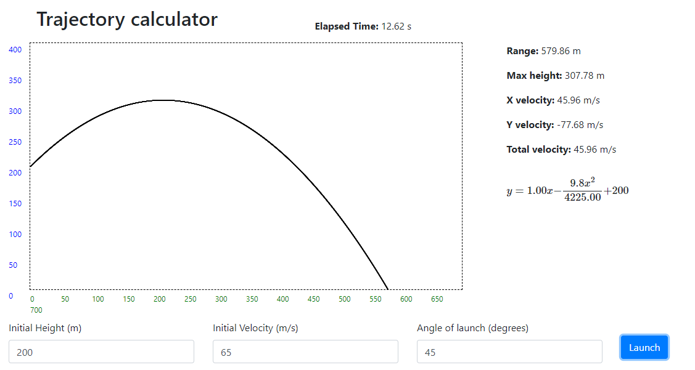

# TrajectoryCalculator
Calculate the trajectory of a projectile launch

# Motivation
Academic project for physics class

# Tech/framework used
* Vanilla JavaScript
* Bootstrap 4
* MathJax

# Authors
* [Rafael Duarte](https://github.com/Duarte10)

# License
This project is licensed under the MIT License - see the [LICENSE](https://github.com/Duarte10/HealthPlace/blob/main/LICENSE) for more details